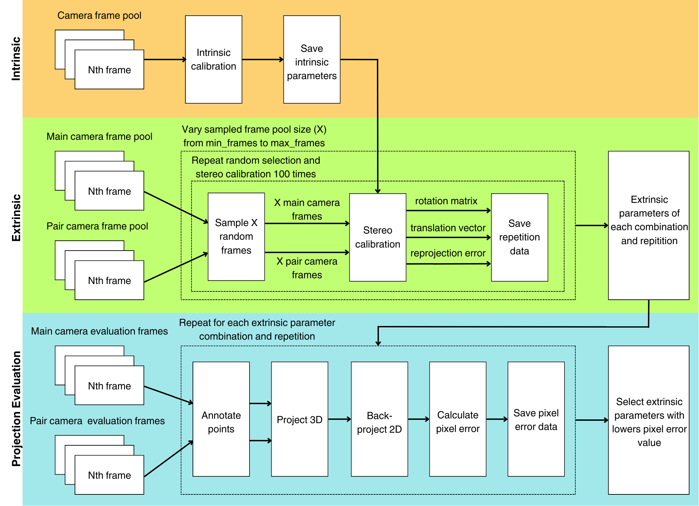
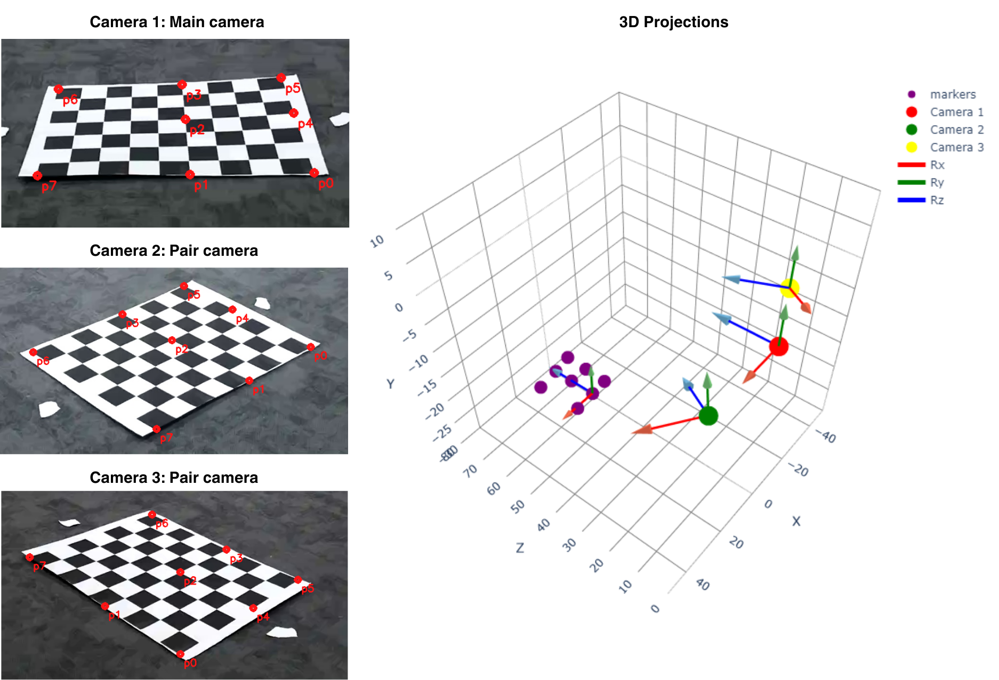
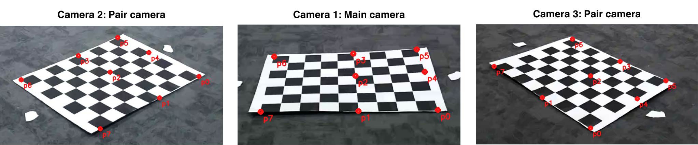

# Stereo Calibration and Evaluation Toolbox

This repository contains Python scripts for stereo calibration and evaluation using OpenCV, designed to calibrate and evaluate stereo camera setups. The toolbox includes functions for intrinsic calibration of individual cameras, stereo calibration between pairs of cameras, triangulation of 3D points, and projection error evaluation. This README provides an overview of the functionality and usage of each module.

## Modules

### Intrinsic Calibration (`opencv_utils.py`)

This module performs intrinsic calibration for a single camera using a set of calibration images containing a chessboard pattern. It computes the camera matrix (`mtx`) and distortion coefficients (`dist`) and saves them for further use.

#### Functionality:
- `intrinsic_calibration(image_paths, run_name, camera, checkerboard_size=(8, 6), world_scaling=1, sample_rate=None)`
  - **Inputs:**
    - `image_paths`: List of paths to calibration images.
    - `run_name`: Name of the calibration run.
    - `camera`: Identifier for the camera ('A', 'B', etc.).
    - `checkerboard_size`: Size of the checkerboard pattern.
    - `world_scaling`: Scaling factor for world coordinates.
    - `sample_rate`: Optional rate for subsampling calibration images.
  - **Outputs:**
    - Saves intrinsic calibration results (`mtx`, `dist`) as `.npz` files.

### Stereo Calibration (`opencv_utils.py`)

This module performs stereo calibration between two cameras using pairs of images. It utilizes intrinsic calibration results to compute external parameters (`R`, `T`) and distortion coefficients for each camera (`mtx_A`, `dist_A`, `mtx_B`, `dist_B`). Results are saved in `.npz` files and calibration metrics are saved to CSV for evaluation.

#### Functionality:
- `optimize_stereo_cal(main_cam_paths, pair_cam_paths, run_name, main_cam, pair_cam, ...)`
  - **Inputs:**
    - `main_cam_paths`: List of paths to images from the main camera.
    - `pair_cam_paths`: List of paths to images from the paired camera.
    - `run_name`: Name of the calibration run.
    - `main_cam`, `pair_cam`: Camera identifiers.
    - Additional parameters for optimization (e.g., frame count, repetitions).
  - **Outputs:**
    - Saves stereo calibration results and evaluation metrics as `.npz` and `.csv` files respectively.

### Triangulation and Projection (`projection_utils.py`)

This module provides functions for triangulating 3D points from multiple camera views and projecting 3D points into 2D image coordinates using camera matrices.

#### Functionality:
- `triangulate_multiple_points(imgpoints_Origin, imgpoints_Pair1, projMatr_Origin, projMatr_Pair1)`
  - Triangulates 3D points from image points in multiple views.
- Projection functions (`projectPixelMain`, `projectInternal`, `projectPixel`) project 3D points to 2D image planes using various parameters.

### Evaluation (`projection_utils.py`)

This module evaluates projection errors of 3D points using external calibration data and saves the results. It computes mean reprojection errors and percentage errors for both cameras in a stereo pair.

#### Functionality:
- `projectEval(run_name, main, pair, all_cam_points, image_size=(1600, 1200))`
  - Evaluates projection errors using external calibration data.
  - **Inputs:**
    - `run_name`: Name of the calibration run.
    - `main`, `pair`: Camera identifiers.
    - `all_cam_points`: List of image points from both camera views.
    - `image_size`: Size of the image for error computation.
  - **Outputs:**
    - Saves evaluation results as `.csv` and copies the best calibration as a `.npz` file.

#### Usage of `all_cam_points` in `projection_utils.py`

When using the `projectEval` function from `projection_utils.py`, ensure that `all_cam_points` follows specific conventions to correctly evaluate projection errors and perform calibration:

- **Conventions for `all_cam_points`:**
  - `all_cam_points[1]`: Must represent the origin of the coordinate system for the camera views.
  - `all_cam_points[0]`: Indicates a point in the image that corresponds to the x-axis direction from the origin point (`all_cam_points[1]`).
  - `all_cam_points[3]`: Indicates another point in the image that also corresponds to the x-axis direction from the origin point (`all_cam_points[1]`).
  - The positions of other points in `all_cam_points` are flexible and do not impact the evaluation directly.

These conventions ensure that the evaluation function correctly interprets the spatial relationship and orientation of the camera views during the projection error computation.

## Usage

To use these modules, follow these steps:

1. **Intrinsic Calibration:**
   - Prepare calibration images for each camera.
   - Call `intrinsic_calibration()` with appropriate parameters.
   
2. **Stereo Calibration:**
   - Prepare pairs of images from two cameras.
   - Call `optimize_stereo_cal()` with image paths and calibration parameters.
   
3. **Triangulation and Projection:**
   - Use `triangulate_multiple_points()` to obtain 3D points from multiple views.
   - Project 3D points using `projectPixelMain`, `projectInternal`, or `projectPixel` functions.
   
4. **Evaluation:**
   - Call `projectEval()` to evaluate projection errors using calibration and image points.

## Manual Annotation of Checkerboard Corners

### Introduction

In addition to logging individual coordinates, this application can be adapted for manually annotating the corners of a checkerboard pattern. This is particularly useful in scenarios where you need precise control over the points of interest, such as for camera calibration or geometric transformations.

### Implementation Details

To implement manual checkerboard corner annotations using this application, follow these steps:

1. **Define Your Image Filename:**
   Ensure that you have your checkerboard image ready and specify its filename in the `image_filename` variable within `app.py`. This image should be placed in the appropriate location accessible to the Flask application.

2. **Logging and Storing Coordinates:**
    Clicking on the checkerboard corners will log the coordinates (x, y) both in the browser and on the server side.
    These logged coordinates can then be further processed or stored as needed for your application.

### Example Use Case

Annotating checkerboard corners manually using this application allows for accurate gathering of reference points needed for subsequent image processing tasks. The logged coordinates can be used for camera calibration, distortion correction, or any application requiring precise spatial referencing.

### Further Customization

Feel free to extend the functionality of the Flask application (app.py) to suit additional requirements or integrate with other systems. This may involve storing coordinates in a database, implementing real-time visualization, or enhancing user interaction.

## Dependencies

- Python 3.x
- OpenCV
- NumPy
- Pandas
- tqdm
- scipy

## License

This project is licensed under the MIT License - see the LICENSE file for details.
